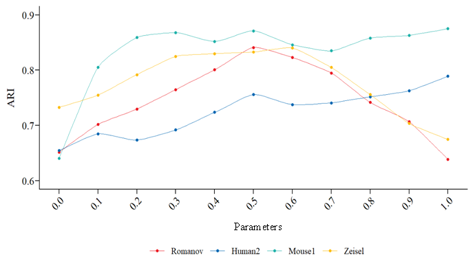
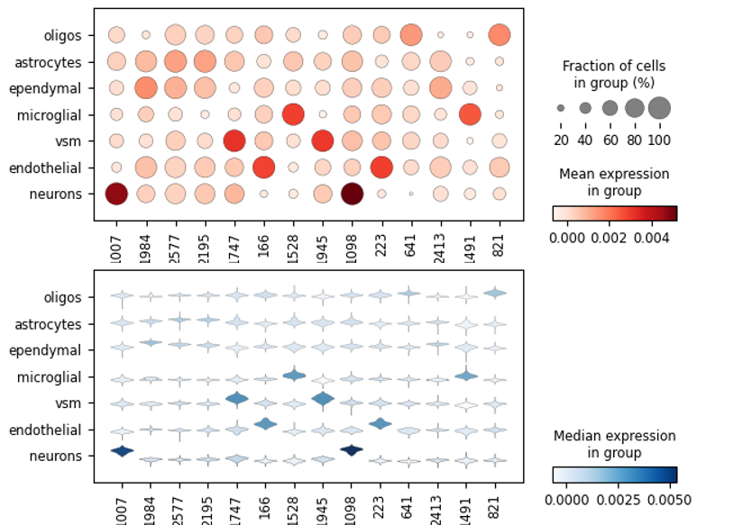
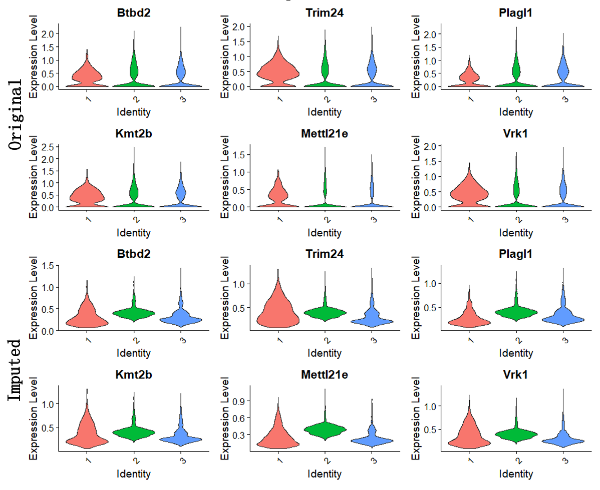
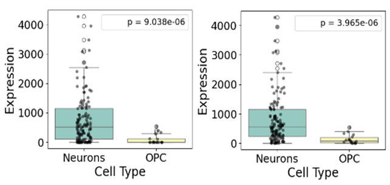

# rebuttle experiments

***\*Supplementary\**** ***\*Figure 1\****: Tuning of the capsule network’s key hyperparameter σ —which determines the width of the Gaussian kernel in the routing-by-agreement procedure and thus controls how sharply capsules couple their outputs.

 

***\*Supplementary\**** ***\*Figure\**** ***\*2\****: Identification of cell-type-specific marker genes across distinct populations.
**Top:** Bubble plot showing, for each selected marker gene and cell type, the average normalized expression (color intensity) and the percentage of cells expressing the gene (bubble size).
**Bottom:** Violin plots depicting the distribution of normalized expression levels for these marker genes within each cell type.

 

***\*Supplementary\**** ***\*Figure\**** ***\*3\****: Comparative expression of cell‐type–specific marker genes in the original versus imputed datasets.

***\*Supplementary\**** ***\*Figure\**** ***\*4\****: Expression of the GAD1 gene in Neurons and OPCs, comparing the original (left panel) and imputed (right panel) datasets. Because GAD1 is significantly enriched in Neurons versus OPCs in the raw data, this comparison tests whether scICLGAE preserves that differential expression and avoids oversmoothing.

 

***\*Supplementary\**** ***\*Figure\**** ***\*5\****: Cell‐type identification via marker gene expression.

 
